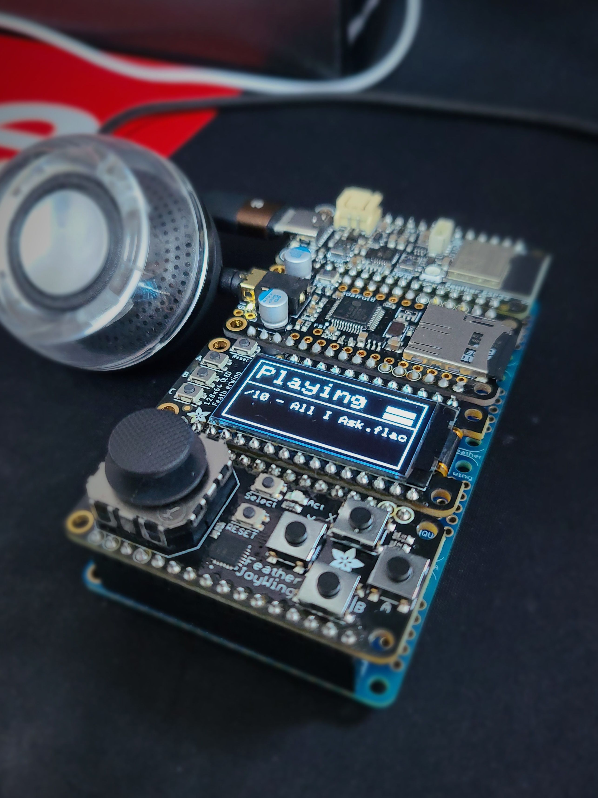

# ESP32_V2_MUSIC_MAKER_FEATHER
Reference: https://github.com/adafruit/Adafruit_VS1053_Library

I built a music player with Adafruit feather and VS1053 library. 
I modified the example of Adafruit VS1053 library to play flac audio files.  

[ Video ]

https://youtube.com/shorts/-MeDtGQJFhY?si=COK8PvEJFyI17bNx

[ Parts List ]
1. Adafruit Quad Side-By-Side FeatherWing Kit with Headers 
https://www.adafruit.com/product/4254

2. Adafruit ESP32 Feather V2 - 8MB Flash + 2 MB PSRAM - STEMMA QT 
https://www.adafruit.com/product/5400

3. Adafruit Music Maker FeatherWing - MP3 OGG WAV MIDI Synth Player 
https://www.adafruit.com/product/3357

4. Adafruit FeatherWing OLED - 128x64 OLED Add-on For Feather - STEMMA QT / Qwiic 
https://www.adafruit.com/product/4650

5. Adafruit Joy FeatherWing for all Feathers 
https://www.adafruit.com/product/3632
